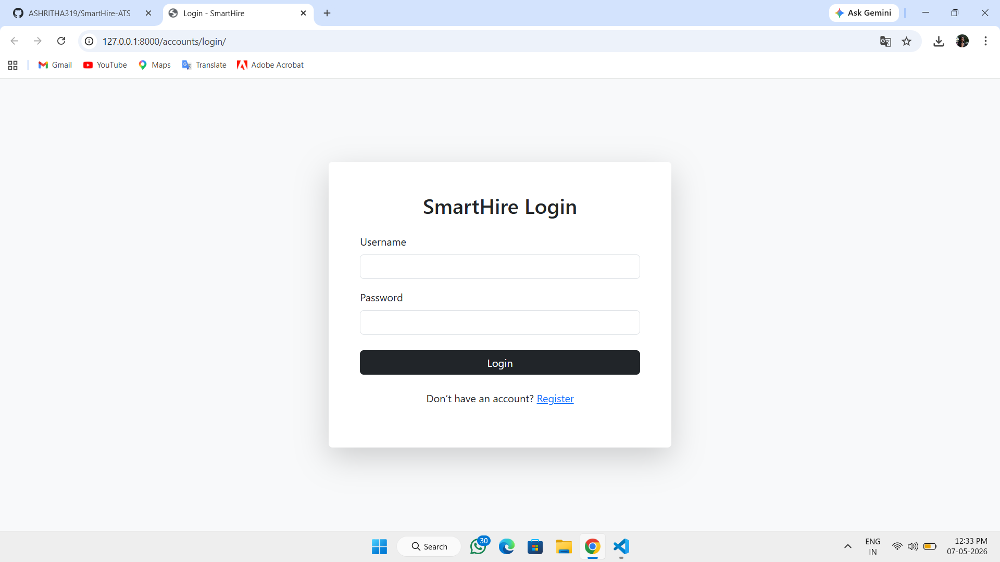
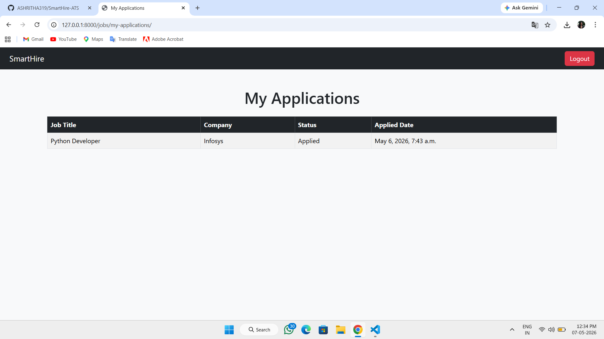
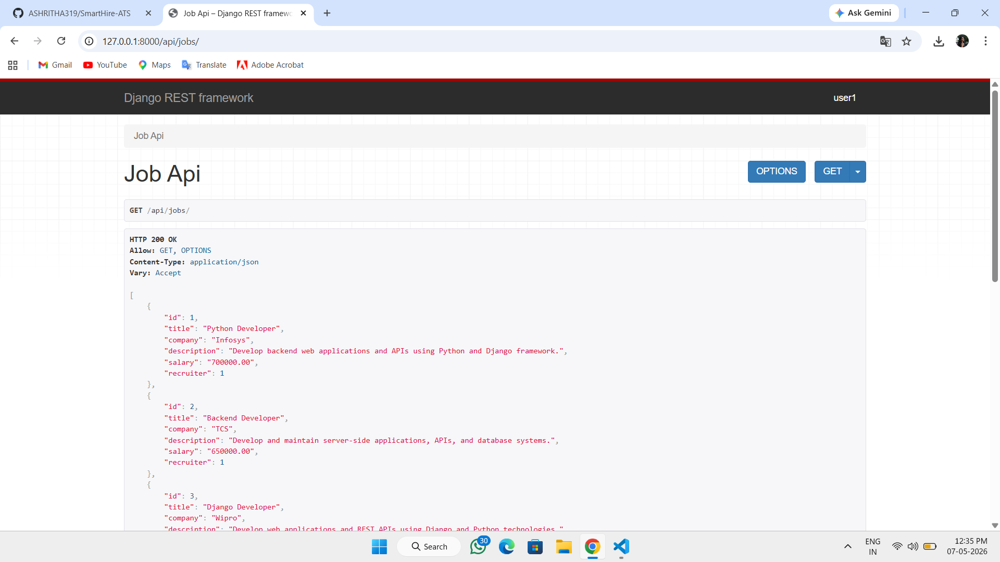

# SmartHire – Job Portal & Applicant Tracking System (ATS)

## Project Overview

SmartHire is a full-stack Job Portal and Applicant Tracking System (ATS) developed using Python and Django. The platform allows candidates to search and apply for jobs while recruiters can manage applications and update candidate statuses.

This project demonstrates backend development concepts such as authentication, role-based access, CRUD operations, REST APIs, search filtering, and database management.

---

# Features

## Candidate Features

* User Registration & Login
* Job Search & Filtering
* Apply for Jobs
* View Applied Jobs
* Track Application Status

## Recruiter/Admin Features

* Manage Job Applications
* Update Candidate Status
* Role-Based Access Control
* Prevent Duplicate Applications

## API Features

* REST API using Django REST Framework
* JSON Response Endpoints

---

# Tech Stack

| Technology            | Used For           |
| --------------------- | ------------------ |
| Python                | Backend Logic      |
| Django                | Web Framework      |
| Django REST Framework | API Development    |
| SQLite                | Database           |
| Bootstrap 5           | Frontend Styling   |
| HTML/CSS              | Frontend Templates |

---

# Project Screenshots

## Login Page



---

## Job Listings Page


---

## My Apllication Page



---

## API Output



Example:

* Login Page
* Job Listings Page
* Recruiter Dashboard
* My Applications Page
* API Output

---

# Installation Guide

## Clone Repository

```bash
git clone <your-github-link>
```

## Navigate to Project

```bash
cd SmartHire
```

## Create Virtual Environment

```bash
python -m venv env
```

## Activate Environment

### Windows

```bash
env\Scripts\activate
```

## Install Requirements

```bash
pip install -r requirements.txt
```

## Run Migrations

```bash
python manage.py migrate
```

## Run Server

```bash
python manage.py runserver
```

---

# API Endpoint

## Get All Jobs

```text
http://127.0.0.1:8000/api/jobs/
```

---

# Key Concepts Implemented

* Authentication & Authorization
* Role-Based Access Control
* Django ORM Operations
* CRUD Functionality
* Search & Filtering
* REST API Development
* Dynamic Template Rendering
* Bootstrap Responsive UI

---

# Future Enhancements

* Resume Upload
* Pagination
* Email Notifications
* JWT Authentication
* Deployment on Cloud

---

# Author

Ashritha B
